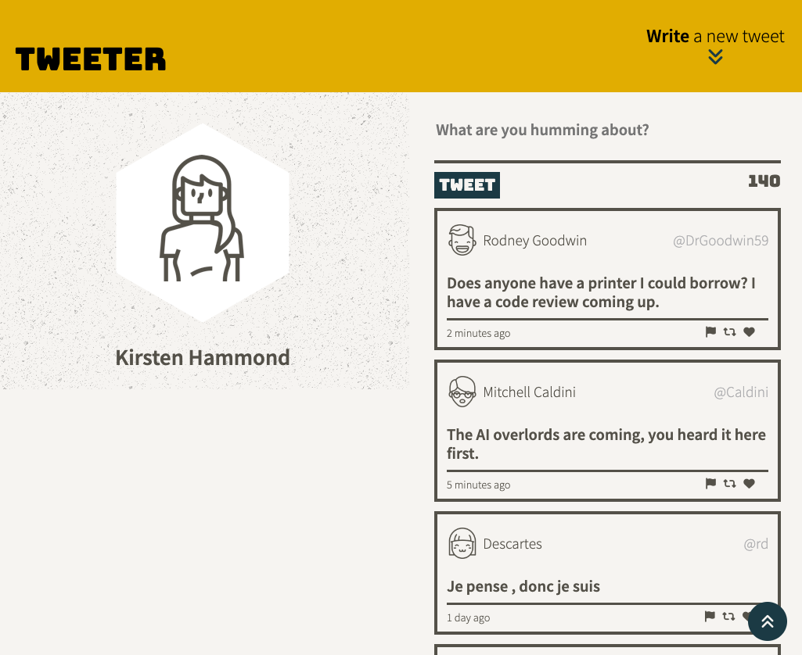
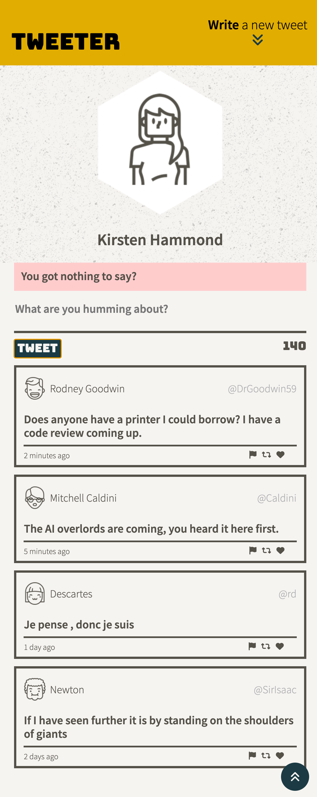
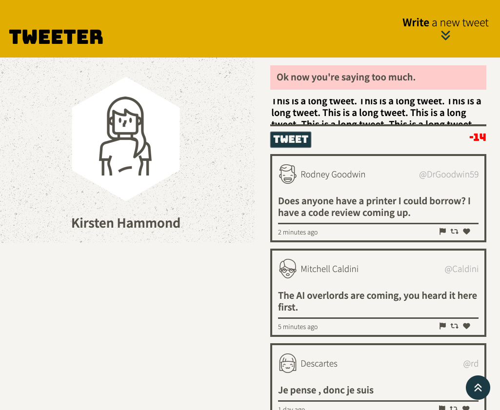

# Tweeter Project

Tweeter is a simple, single-page Twitter clone.

This is an exercise in Front End development, using HTML, CSS, Sass, JS, jQuery and AJAX with some Node and Express back-end manipulation.
The styling was designed to be responsive to laptop and mobile/tablet screen sizes.

---
## Final Product

---

## Getting Started

1. Clone this repository onto your local device.
2. Install dependencies using the `npm install` command.
3. Start the web server using the `npm run local` command. The app will be served at <http://localhost:8080/>.
4. Go to <http://localhost:8080/> in your browser.
5. Submit tweets and see them display immediately. 

---

### Acknowledgements

The server side logic was provided by LightHouse Labs. The master branch can be found [here](https://github.com/lighthouse-labs/tweeter).